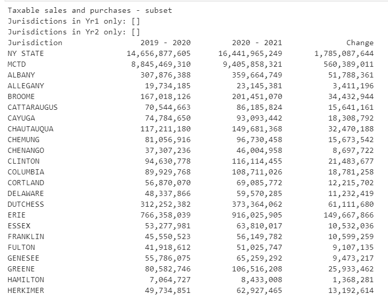
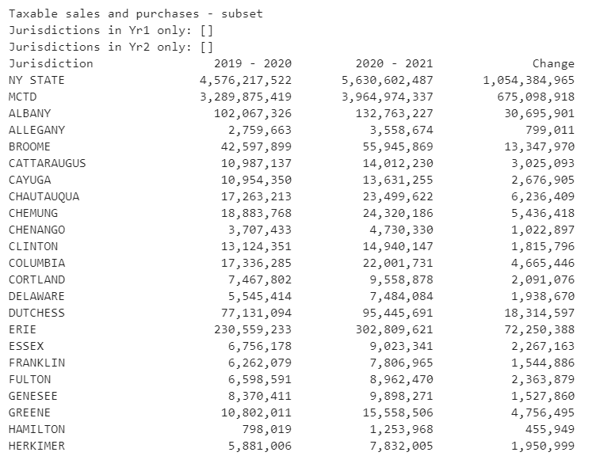
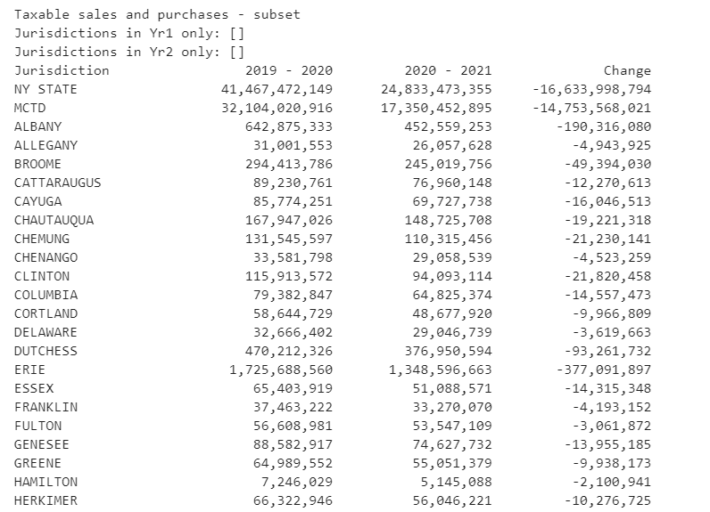
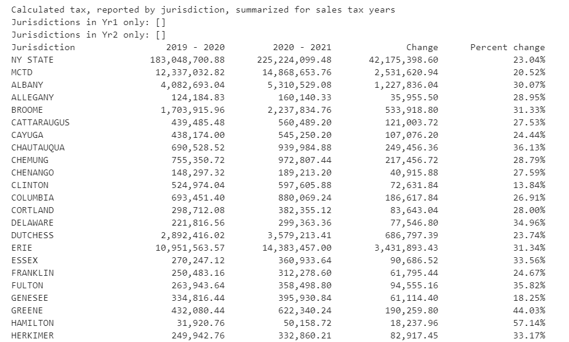
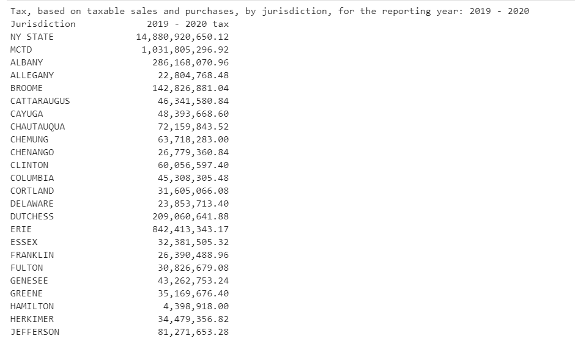
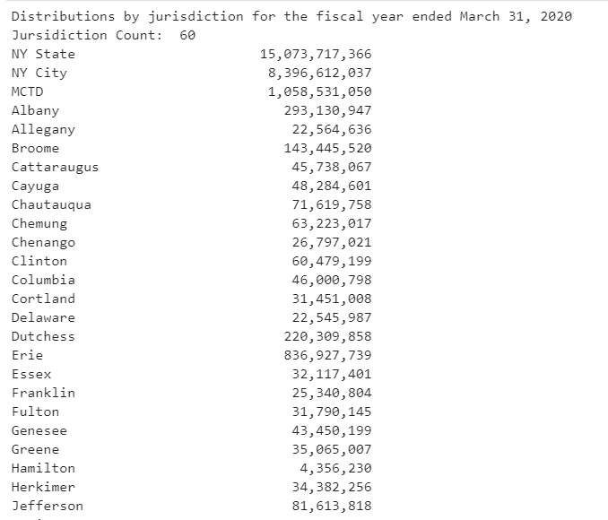
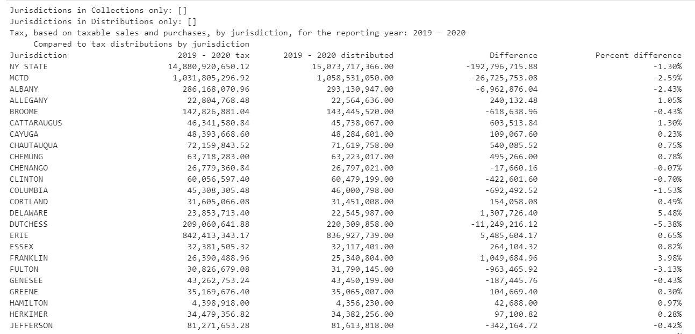
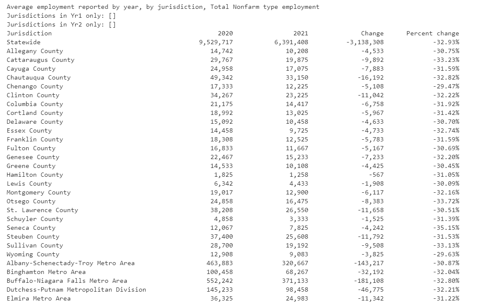
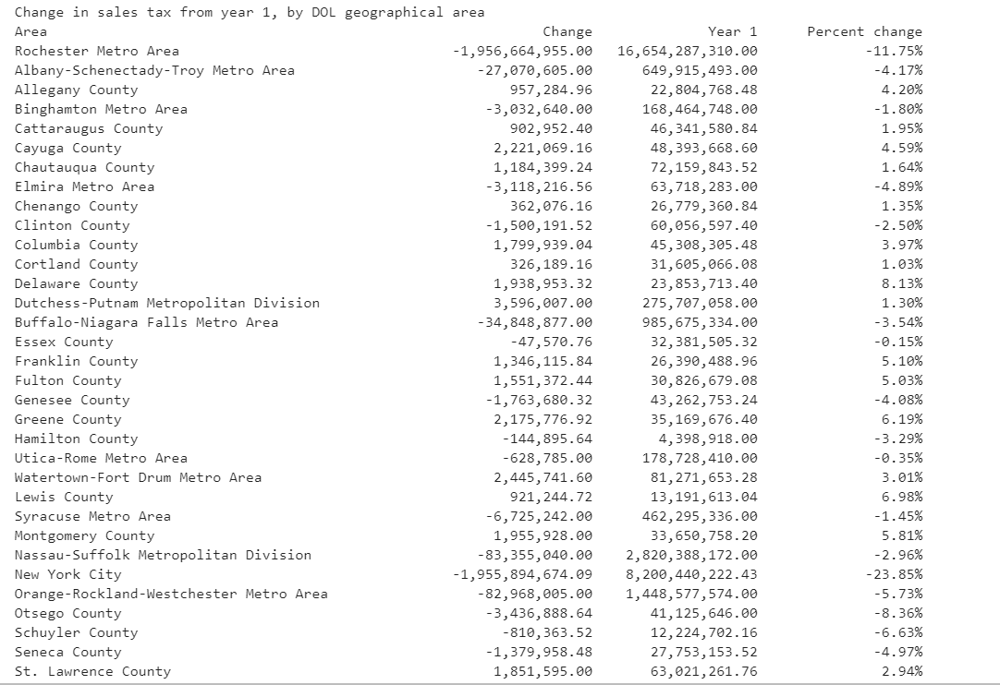
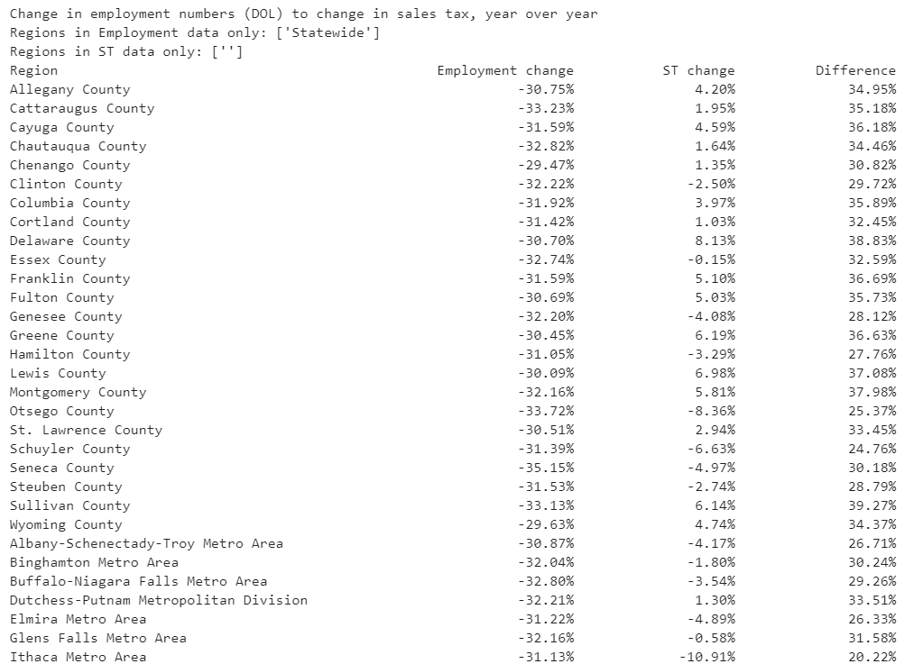

    

# What did we find out

Analysis was successful on the first three datasets.

## Sales by Industry

The sales tax reported dataset included NAICS codes, or industry designations.  I created data subsets of 3 industries which are now known to have been impacted during the pandemic:

#### NAICS code 4441 is Building Material and Supplies dealers - for example, Home Depot 

#### NAICS code 4453 is Beer, Wine, and Liquor Stores 

#### NAICS code 7225 is Restaurants and Other Eating Places 

As you can see, the restaurants sales declined, but sales at building materials and beer, wine, and liquor stores increased.  Further analysis that might be interesting would be to create a year over year based on the entire state, by NAICS code, rather than the jurisdictional breakdown for a specific NAICS code.

### Calculated tax

For NAICS 4453, the calculated change in tax revenues:

The percentage change is particularly notable.  One that sticks out is Hamilton County at a nearly 60% increase.  Hamilton County only has a population of less than 5,000 people, though people may have temporarily moved to the county (in the middle of the Adirondacks), from urban areas such as NYC, during the pandemic year as they were working remotely.  It also may be a reflection of the decrease in restaurant sales; people were both eating and drinking at home since they could not do so in restaurants for much of the year.

## Comparing collected vs distributed

For all industries, the calculated tax for the sales tax year ended February 29, 2020:

Distributions of tax to the jurisdictions for the fiscal year ended March 31, 2020:

Comparing the calculated tax collected to the distributions:

The calculated collections versus the distributions are very close!  We must keep in mind that this analysis is somewhat estimated, as there are exemptions, special jurisdictional tax rates, and MTCD tax specifics which aren't taken into full account here.  As they say, this is close enough for government work, and I am confident that NYS is distributing all taxes which are remitted.

## Employment data

Total Nonfarm type employment, year over year, from 3/1/2019-2/29/2020 to 3/1/2020-2/28/2021:

Sales tax collected, by DOL geographical areas, from 3/1/2019-2/29/2020 to 3/1/2020-2/28/2021:

Percentage change in employment vs percentage change in sales tax:

Although NYC sales tax revenues were significantly impacted over the pandemic year (-23.85%), it was the only geographical which saw such a significant impact.  In fact, many locations actually show an <i>increase</i> in sales tax revenue.

| Jurisdiction | Employment | Sales tax | Difference |
|:---:|:---:|:---:|:---:|
| New York City | -33.47% | -23.85% | 9.61% |

However, the Total Nonfarm employment numbers show significant decreases across all geographical areas.  Although there were industries which were basically shut down or reduced tremendously for the entire sales tax and fiscal years (hospitality, travel, and leisure related industries), this was a temporary situation, even though duration was unknown.  This is in contrast to buggy whip manufacturing or VHS tape manufacturing layoffs when technology changes; the jobs were expected to come back when the economy was reopened.  

Because of the different reasons behind the employment impact, people may have felt confident that they could spend money on projects at home, with the expectation that their cash flow situation was merely temporary.  In addition to this expectation, there was a lot of encouragement to support the economy that remained open.  People may also have spent money which they normally would have spent on vacations, both in state or out of state, on home improvement projects.

## Summary: what we set out to find out vs where we ended up

Of the analysis which I was able to complete, I determined:

- [X] Tax collected by jursidiction versus tax distributions by jurisdicton: difference between calculated tax and distributions was immaterial
- [ ] Tax collected versus employment statistics did not show any obvious correlation over the time period reviewed
        

    
<h1 style="font-size:1vw">
        <i>
            <a href = "README.md">RETURN TO MAIN MARKDOWN PAGE</a></h1>
    

    

    

