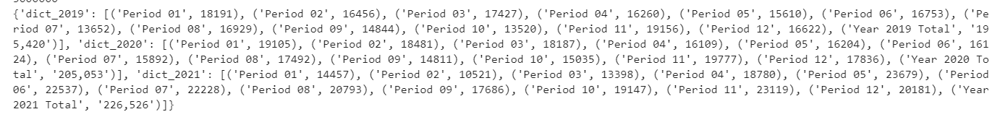

<center>
    
</center>

# Potholes encountered along the way

## Well, that didn't go as planned...

Sometimes, more is learned from when things don't work than when they do work.  What follows are some of the hurdles I encountered.

### Making comparisons

In order to compare calculated numbers, the calculations were stored in dictionaries.  These dictionaries had to be compared to identify any keys were were in one dictionary, but not the other, because otherwise, the results may not show the one-side, or an error might be displayed instead of results.

### Matching jurisdictions

Not only were jurisdictions different for different datasets (school districts in sales tax distributions, geographical areas in DOL dataset), but formatting was different as well.  Using .upper() attached to one or both variables when comparing the strings allowed the formats to be the same.  Since St. Lawrence County was the only jurisdiction which had a period in it, I made sure that the punctuation was the same when creating files such as tax rates and geographical areas.


### Storing the results

Because I wanted to organize the code in separate notebooks by dataset, I needed a way to store the results of code from 1 dataset notebook for use in another.  To accomplish this, I stored the data in a dictionary as it was iterated through, then wrote the dictionary to a csv file.  This code created a dictionary with 2 values, 1 from each of 2 separate dictionaries, for each key:

```python
## store the yr 1 and yr 2 values along with jurisdition in a list of dictionaries, to be saved as a csv file, 
##    for use in comparison with employment statistics
    item_dict = {}
    ikeys = ["Jurisdiction", "Yr1", "Yr2"]
    i_j = key
    i_yr1 = value
    i_yr2 = tax2_hist[key]
    ivalues = [i_j, i_yr1, i_yr2]
    item_dict = dict(zip(ikeys, ivalues))
    st_change.append(item_dict)
```

### Indentations are really important

And so is having an idea of what the results <i>should</i> look like.

When working with the taxable sales and purchases data, classifying the data into the DOL geographic areas, I noticed that Cayuga County was showing nearly &#36;50 million.  I checked it against the dataset 1 queries, and found that it should have been only 3.4 million.  Adding more print commands, and some head scratching, I realized that the code to calculate the running totals was indented incorrectly, causing a compounded calculation.  Once this was corrected, the results tied to that of dataset 1 for the minor counties which DOL does not include in a metropolitan geographical area.


<p align="center">
    <center>
<br><a href="https://giphy.com/gifs/reaction-453QsWPQj5bsQaqp8M" title="They've blown out one of our engines!" alt="fix it.">via GIPHY</a></p></center>


### Calculations - no strings!

Instructions often had to be include a treatment as a specific type, or calculations would not work.  For example, when calcuating the tax based on the taxable sales and purchases (variable: value) and tax rate (variable: rate), both variables were transformed to integer and float, respectively, within the calculation:

```python
tax = round(int(value)*float(rate),2)
```

### Iterating through nested loops

Working with the distribution data (dataset 2), the jurisdictions did not match up with the collections data (dataset 1).  To work with this, I created a csv file which designated a "major jurisdiction" for each "sub jurisdiction".  The reasons behind these mismatches were generally cities which are distributed to individually, as well as residential utility tax jurisdictions.  Information was obtained from a report issued by the Office of the State Comptroller: ["Understanding Local Government Sales Tax in New York State"](https://www.osc.state.ny.us/files/local-government/publications/pdf/understanding-local-government-sales-tax-in-nys-2020-update.pdf).

In order to create a dictionary with the major jurisdictions and taxes distributed, the python code included nested loops.  But the output returned was only for a handful of major jurisdictions.  It seemed as if something wasn't being reset after success in the inner loop, and then I was only getting success for the first time it went into the inner loop.  After much frustration, I was able to figure out that the file used for the inner loop did in fact need to be reset - once it got to the end, there was nothing left to look when the next outer iteration instructed to loop through.  The reason it had been working on a few major jurisdictions early on was that I was breaking out of the inner loop, leaving some rows to be iterated through.

```python
for row in reader :
    j = row[1]
    y = row[0]
    d = row[2]
    # need to reopen the file each time
    reader2 = csv.reader(open(fn2,'r'))
    if y == '2020' and d != '' :
        for line in reader2 :
            jur = line[0]
            tax_jur = line[1]
            if jur in j or j in jur :
                j2 = tax_jur
                if j2 in DistributeHist.keys() :
                    dist = int(DistributeHist[j2])
                    add_dist = int(d)
                    DistributeHist[j2] = dist + add_dist
                    break
                else:
                    DistributeHist[j2] = int(d)
                    ## count items in JurisCount
                    JurisCount += 1
                    break
```

### Accountants are particular about commas, percentages, and alignment

I was able to print dollar amounts and percentages with 2 decimal places, and to align the numbers to the right by using f-string literals such as this:

```python
print(f"{key:20}{value:>20,.2f}{tax2_hist[key]:>20,.2f}{change:>20,.2f}{percent:>20.2%}")
```

To break this down:

f"" around the specifications indicates an f-string

{ } indicates each field

The first item within the curly braces is the variable.

Following the semi-colon, the greater than sign indicates right-align, the number 20 indicates that the field should take up 20 characters, a comma indicates that the number should be formatted with commas, .2f indicates that there should be 2 floating decimals, and the % indicates a percentage (.2% indicates percentage rounded to 2 decimal places).

### The biggest constraint is time

Because things never go as planned, and getting the code working correctly did not go as smoothly as planned, I was unable to get to the point where I could compare the employment statistics to the sales tax revenues, nor the corp tax credits to the  sales tax revenues (albeit older).

In working with the DOS (corporations established) dataset, I created a dictionary with the corporations established in each year, but I struggeled to be able to work with these results.

```python
 # define a dictionary in the filed_dict dictionary as 'dict ' + reporting year
    filed_dict['dict_' + str(CountYear2)] = sorted_Periods
```



<p align="center">
    <center><h1 style="font-size:1vw">
        <i>
            <a href = "README.md">RETURN TO MAIN MARKDOWN PAGE</a></h1>
    </center>
    </p>    


</center>
</center>
